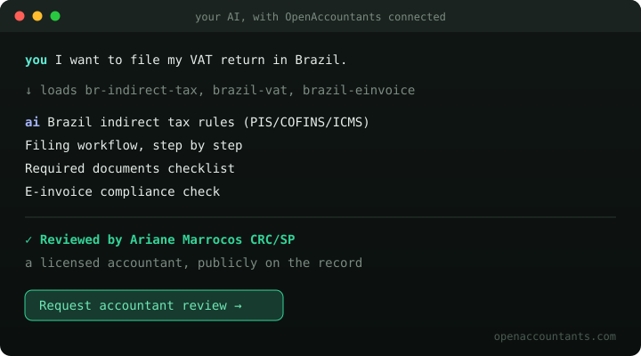

# OpenAccountants

**The open-source tax layer for AI agents.** Tax Guides your AI can cite, reviewed by named accounting professionals.

[](LICENSE)
[](https://pypi.org/project/openaccountants-mcp/)
[](https://smithery.ai/servers/info-ood9/openaccountants)
[](https://github.com/openaccountants/openaccountants/stargazers)

1,000+ Guides across 190+ jurisdictions. Works with **Claude, ChatGPT, Cursor, Windsurf, and any MCP-compatible agent**. Every Guide is either a **source-cited draft** (written from primary legislation, every figure cited) or **accountant-reviewed** (a licensed Partner checked the complete Guide, and their name is on it).

> 🔍 **Real professional review, in public.** In July 2026, Christopher Aryee, CPA reviewed our four core US federal form Guides against the One Big Beautiful Bill Act and returned **33 sourced corrections** (rates, thresholds, statutory citations). The full red-line is public: [see the diff →](https://github.com/openaccountants/openaccountants/pull/45/files) That loop (a named professional publicly correcting the tax data your AI relies on) is the whole point of this project.

⚠️ **General reference only, not advice.** Have a qualified professional review outputs before filing, payment, or action. <details><summary>Read the full disclaimer</summary>

> OpenAccountants provides general tax and accounting reference material for AI-assisted workflows. It is **not** a law firm, accounting firm, tax preparer, or return-filing service, and its outputs are **not** tax, legal, accounting, or financial advice. Guides may be incomplete, outdated, or wrong, and are not reviewed for any specific person's facts, elections, deadlines, residency, or local procedures. Always have a qualified professional review outputs before filing, payment, or action. A *source-cited draft* has **not** been reviewed by a credentialed accountant.
</details>

---

## What it does



```
You:    "I'm a freelancer in South Africa. What do I owe?"
          ↓  OA loads za-income-tax, za-provisional-tax
AI:     ITR12 working paper
        Provisional tax schedule (IRP6, Aug + Feb)
        Medical tax credits
        Retirement annuity deduction
        ─────────────────────────────────────────
        Reviewed by Werner Britz CA(SA)
        [Request accountant review →]
```

**[Add to your AI →](https://www.openaccountants.com/connect)**   |   **[Browse Guides →](https://www.openaccountants.com/skills)**   |   **[Become a Partner →](https://www.openaccountants.com/for-accountants)**

---

## Install in 60 seconds

**Hosted (1 step, always current):** add the OpenAccountants connector to your AI at [openaccountants.com/connect](https://www.openaccountants.com/connect), or point any MCP client at:

```
https://www.openaccountants.com/api/mcp
```

**Local (2 steps, no clone needed):** the PyPI package ships with all Guides bundled.

```bash
pip install openaccountants-mcp     # or: uvx openaccountants-mcp
```

```json
{ "mcpServers": { "openaccountants": { "command": "openaccountants-mcp" } } }
```

Works in Claude Desktop (`claude_desktop_config.json`), Cursor (`.cursor/mcp.json`), Claude Code, Windsurf, and any MCP-aware client. Full setup and env vars: [mcp/README.md](mcp/README.md).

**Manual (no MCP):** download a folder from [`packages/`](packages/) and drag the `.md` files into your AI. Read [START-HERE.md](START-HERE.md) for scenarios and what to say.

---

## Partners: the named professionals behind the Guides

These licensed practitioners have reviewed Guides for their jurisdictions. Their name appears on every answer the AI gives from a Guide they reviewed, and their reviews are public.

| Jurisdiction | Partner | Guides | Proof |
|---|---|---|---|
| United States (federal forms) | **Christopher Aryee, CPA** | 4 | [33 OBBBA corrections, full diff](https://github.com/openaccountants/openaccountants/pull/45/files) |
| United States | Amir Pelinkovic CPA | 16 | [profile](https://www.openaccountants.com/network/752ee18a-3843-434d-8426-457d3fa9706f) |
| United Kingdom | James Power | 15 | [profile](https://www.openaccountants.com/network/30b2f478-3a97-40c4-b435-0678829b487e) |
| India | Mayur Deokar CA | 13 | [profile](https://www.openaccountants.com/network/f4cb8476-a86d-4fd9-b536-9217e82ccf99) |
| Indonesia | Rilia Putri CA | 10 | [profile](https://www.openaccountants.com/network/ec70d43e-18c0-4b4e-b92c-4f8a22e10152) |
| Brazil | Ariane Marrocos CRC/SP | 9 | [profile](https://www.openaccountants.com/network/366f5c0f-1afb-4332-b87b-9b6f912821aa) |
| Portugal | Mário Vale CA | 9 | [profile](https://www.openaccountants.com/network/a26a63b7-343c-451b-8266-bb9d28bd7089) |
| Saudi Arabia | Mehran Habib | 9 | [profile](https://www.openaccountants.com/network/f9dbab51-2b89-451b-98f2-414b48fb4599) |
| South Africa | Werner Britz CA(SA) | 5 | [profile](https://www.openaccountants.com/network/28a3ec1b-d699-4c5d-bb60-3114eedc59d0) |
| Malta | Michael Cutajar CPA (Malta) | 5 | [profile](https://www.openaccountants.com/network) |
| Nepal | Ashish Bista CA | 5 | [profile](https://www.openaccountants.com/network/78ab67db-8f29-4746-8102-7b52d17309aa) |
| **Your jurisdiction** | Open (130+ still unclaimed) | — | [Become a Partner →](https://www.openaccountants.com/for-accountants) |

> Accountant-reviewed Guides (Tier 1) are served via the MCP server with the Partner's name on every output. Guides in this repo that no Partner has reviewed yet are source-cited drafts (Tier 2).

Licensed accountant? Review a complete Guide for your jurisdiction and your name goes on it, publicly and permanently. [Start here.](https://www.openaccountants.com/for-accountants)

---

## Two ways to use

| | MCP connector *(recommended)* | Manual upload from this repo |
|---|---|---|
| **What you get** | Accountant-reviewed Guides, the reviewing Partner's name on every answer, AI-to-human handoff (`request_accountant_review` routes to a real accountant with your worksheet attached) | Source-cited drafts, no reviewer attribution, no handoff |
| **How** | [openaccountants.com/connect](https://www.openaccountants.com/connect), or the install above | Download a folder, drag `.md` files into your AI |
| **Best for** | Anyone who wants to actually use OpenAccountants | Developers and accountants who want to audit, fork, or contribute |
| **Clients** | Claude.ai, ChatGPT (Business+), Cursor, Windsurf, Claude Desktop, Claude Code, any MCP-aware client | Any AI that reads files |

**This repo is the public record.** Every rate, every review, every correction is auditable here, in the open, with git history. The hosted MCP serves the same content plus the live review layer.

---

## Quick start (manual path)

### 1. Find your jurisdiction

```
packages/
├── malta/           ← income tax + VAT + SSC + payroll + formation + bookkeeping
├── uk/              ← SA103/SA100 + VAT100 + NIC + CGT
├── germany/         ← Einkommensteuer + UStVA + payroll (fullest package)
├── brazil/          ← IRPF + PIS/COFINS + e-invoice + payroll
├── south-africa/    ← ITR12 + VAT + provisional tax
├── us-federal/      ← 1040 / 1120 / 1065 / 1041 form guides (CPA-reviewed, OBBBA-current)
├── ... 130+ more countries
├── us-ca/           ← Federal Schedule C/SE + California state
├── ... 51 US state packages
├── ca-on/           ← Federal T1/T2125 + Ontario
├── ... 13 Canadian province/territory packages
```

**New here?** Read [START-HERE.md](START-HERE.md): scenarios, file lists, what to say to the AI. The full machine-readable inventory of every Guide is [`index.json`](index.json).

### 2. Upload to your AI

- **Claude.ai** → Create a Project, add files as Project Knowledge
- **ChatGPT** → Attach files or create a Custom GPT
- **Any other AI** → Attach or paste the files

### 3. Go

```
Help me with my 2025 taxes. Here's my bank statement.
Help me set up a company in Malta.
Run my payroll for this month.
Prepare my annual accounts.
Optimize my tax. What deductions am I missing?
Check my invoice compliance for EU e-invoicing.
```

The AI asks a few questions, loads the right Guides, and produces a working paper for your accountant.

---

## What's in each package

| File | What it does |
|------|-------------|
| `foundation.md` | Tells the AI how to work: conservative defaults, output format, classification rules |
| `intake.md` | Onboarding questions, refusal checks, document inference |
| `[country]-income-tax.md` | Income tax brackets, deductions, transaction patterns |
| `[country]-vat.md` | VAT/GST/sales tax rules, supplier patterns, form mappings |
| `[country]-ssc.md` | Social security / pension contributions |
| `[country]-payroll.md` | PAYE withholding, employer filing (15 countries) |
| `[country]-formation.md` | Entity types, registration, costs (13 countries) |
| `[country]-bookkeeping.md` | Chart of accounts, P&L, balance sheet (13 countries) |
| `[country]-financial-statements.md` | Annual accounts, reporting framework (13 countries) |
| `[country]-transfer-pricing.md` | TP documentation, arm's length, CbCR (15 countries) |
| `[country]-tax-optimization.md` | Legal deductions, timing strategies (14 countries) |
| `[country]-crypto-tax.md` | CGT on crypto, DeFi, staking, NFTs (22 countries + all US states) |
| `[country]-guided-intake.md` | Full guided experience (13 countries) |
| `[country]-return-assembly.md` | Cross-checks: VAT × IT × SSC (13 countries) |

**Special packages:** `_cross-border/` (37 skills) · `_verticals/` (14 industry skills) · `_integrations/` (10 platform skills: Xero, QuickBooks, Stripe, Wise, Shopify, and more) · `us-federal/` (US federal form guides + machine-readable `rates.2025.json` / `rates.2026.json`)

---

## Coverage

### Full accounting suite (13 countries)

Tax + bookkeeping + payroll + formation + financial statements + transfer pricing + tax optimization:

Malta · UK · Germany · Australia · Canada · India · Spain · France · Japan · Netherlands · Portugal · Belgium · United States (CA)

### Multi-skill countries (~56 countries)

VAT + income tax + social contributions (and often more):

Argentina, Austria, Belgium, Brazil, Bulgaria, Chile, China, Colombia, Croatia, Cyprus, Czech Republic, Denmark, Estonia, Finland, Greece, Hong Kong, Hungary, Indonesia, Ireland, Israel, Kenya, Latvia, Lithuania, Luxembourg, Malaysia, Mexico, New Zealand, Nigeria, Norway, Pakistan, Panama, Peru, Philippines, Poland, Qatar, Romania, Saudi Arabia, Singapore, Slovakia, Slovenia, South Africa, South Korea, Sweden, Switzerland, Taiwan, UAE, and more.

### Crypto tax (22 countries + all 51 US states)

Malta, UK, Germany, France, Australia, Canada, Israel, India, Japan, Spain, Netherlands, Portugal, Italy, Singapore, Brazil, Mexico, Sweden, Belgium, Switzerland, South Korea, New Zealand, and every `us-<state>` package.

### VAT/GST only (65 countries)

Consumption tax classification with local supplier pattern libraries. From Albania to Zimbabwe.

Full coverage breakdown: [docs/QUALITY-TIERS.md](docs/QUALITY-TIERS.md) · Machine-readable: [`index.json`](index.json)

---

## How the Guides work

### The supplier pattern library

Every Guide contains a lookup table of local vendors. When the AI sees "BANK OF VALLETTA" or "DEUTSCHE TELEKOM" or "STRIPE PAYMENTS UK LTD" on your bank statement, it already knows the classification. No guessing.

### Three outcomes per transaction

| Outcome | Means | What happens |
|---------|-------|-------------|
| **Classified** | Documents carry enough info | Applied automatically |
| **Assumed** | Data missing, conservative default applied | Flagged for your reviewer |
| **Needs Input** | Can't proceed without asking | One targeted question |

### Conservative defaults

When uncertain, the system always assumes MORE tax, never less. Your accountant can override a conservative position. They can't easily undo an aggressive one.

---

## Are you an accountant?

Most Guides are source-cited drafts: written from primary legislation but awaiting a credentialed review. Become a **Partner** for your jurisdiction, review a complete Guide, and it becomes accountant-reviewed with your name on every answer the AI gives from it. Christopher Aryee's [33-correction OBBBA review](https://github.com/openaccountants/openaccountants/pull/45/files) is what that looks like in practice.

**You don't need GitHub.** Just:

1. Apply at [openaccountants.com/for-accountants](https://www.openaccountants.com/for-accountants) (credentials reviewed in 1–2 business days)
2. Open a Guide in your review queue, check every figure against the sources
3. Approve it or return sourced corrections. Either way your review is on the record

Or: fork, fix a rate against your tax authority's guidance, PR. **Your name on the Guide either way.**

> 130+ jurisdictions are still open for a Partner. [Claim yours →](https://www.openaccountants.com/for-accountants)

---

## Contribute

| What | How | Impact |
|------|-----|--------|
| **Check a rate** | Check a number against your tax authority, open a PR | Strengthens a source-cited draft |
| **Fix an error** | Find a wrong rate or outdated threshold, submit the correction | Prevents bad working papers |
| **Add bank patterns** | Add how transactions appear on your local bank statement | Fewer misclassifications for every user in your country |
| **Add a tax Guide** | Write an income tax, VAT, or SSC Guide for your country | Fills a gap for every user in that jurisdiction |
| **Add a domain Guide** | Bookkeeping, payroll, formation, financial statements, TP, or crypto | Expands the full accounting suite for your jurisdiction |
| **Add structured rates** | Extend `rates.YYYY.json` to your jurisdiction | Unlocks programmatic/computational use |

See [CONTRIBUTING.md](CONTRIBUTING.md) for the full guide and [docs/REPO-LAYOUT.md](docs/REPO-LAYOUT.md) for which file to edit. Every contributor is credited publicly on the Guide and at [openaccountants.com](https://openaccountants.com).

**Pull requests:** contributions are accepted under the [Contributor License Agreement (CLA.md)](CLA.md).

If this repo saves you one email to your accountant, star it. Stars get jurisdictions reviewed faster.

---

## For developers

### Repo structure

```
openaccountants/
├── index.json             ← Machine-readable inventory of every Guide (start here, agents)
├── packages/              ← Ready-to-use jurisdiction packages
│   ├── malta/ uk/ ...     ← generated from skills/ (don't edit directly)
│   ├── us-federal/        ← HAND-AUTHORED US federal form guides + rates JSONs (edit directly)
│   └── ... 130 countries + 51 US states + 13 Canadian provinces
├── skills/                ← Source files for everything except us-federal
│   ├── foundation/        ← Workflow bases (universal, VAT, payroll, etc.)
│   ├── federal/           ← US federal topical skills
│   ├── international/     ← Country-specific skills
│   ├── cross-border/      ← WHT, PE risk, treaty corridors
│   ├── verticals/         ← Industry-specific
│   └── integrations/      ← Platform export formats
├── workflows/             ← Structured advisor workflow definitions
├── mcp/                   ← The MCP server (also on PyPI as openaccountants-mcp)
├── scripts/
│   ├── build-packages.py  ← Generates packages/ from skills/ (us-federal is protected)
│   ├── build-index.py     ← Generates index.json
│   └── validate-guides.py ← CI validation (runs on every PR)
└── docs/                  ← Layout, quality tiers, coverage, templates
```

Full layout and "which file do I edit": [docs/REPO-LAYOUT.md](docs/REPO-LAYOUT.md)

### Rebuild packages after editing skills

```bash
python3 scripts/build-packages.py   # us-federal is never touched
python3 scripts/build-index.py      # refresh index.json
```

---

## Known limitations

- **LLMs hallucinate.** These files steer the model; they don't guarantee correct numbers. Always have a qualified professional review before filing.
- **Tax law changes.** Rates and thresholds go out of date. The repo is a snapshot; [openaccountants.com](https://openaccountants.com) may be ahead of what you cloned. (When a professional catches drift, it lands here as a public correction, like [PR #45](https://github.com/openaccountants/openaccountants/pull/45).)
- **Coverage is uneven.** 13 countries have the full accounting suite; many jurisdictions have VAT only or partial coverage. Check each country folder's README or [`index.json`](index.json).
- **Newer domains need more eyes.** Bookkeeping, payroll, formation, and financial statements Guides are source-cited drafts with fewer Partner reviews than the core tax Guides.

---

## Disclaimer

OpenAccountants provides general tax and accounting reference material for AI-assisted workflows. It is **not** a law firm, accounting firm, tax preparer, or return-filing service. Outputs are **not** tax, legal, accounting, or financial advice, are not reviewed for your specific facts, and must be reviewed by a qualified professional before filing, payment, or action. Using a Guide does not create a client relationship. A *source-cited draft* has not been reviewed by a credentialed accountant; only an *accountant-reviewed* Guide carries a Partner's review, and that review is of reference material, not of any specific taxpayer's situation.

The most up-to-date, reviewed version is maintained at [openaccountants.com](https://openaccountants.com).

## Contact

**info@openaccountants.com** · [openaccountants.com](https://openaccountants.com)

## License

Dual-licensed: [AGPL-3.0](LICENSE) for open-source use, [commercial license](COMMERCIAL_LICENSE.md) for proprietary products.

Contributions are licensed to the project under the [Contributor License Agreement](CLA.md). See [CONTRIBUTING.md](CONTRIBUTING.md).
