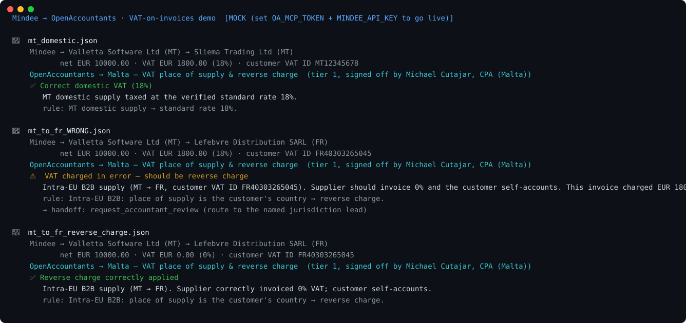

# Mindee → OpenAccountants: VAT-on-invoices demo

**The pitch in one line:** Mindee reads the invoice. OpenAccountants tells you whether the VAT on it is *correct* — under the verified rules of the right jurisdiction, signed off by a named licensed accountant.

```
invoice.pdf
  └─ Mindee  →  { supplier_country, customer_country, vat_id, net, vat_rate, vat_amount, lines }
        └─ OpenAccountants MCP  →  load the verified VAT skill for that jurisdiction
              └─ Verdict:  ✅ reverse charge correctly applied   /   ⚠️ VAT charged in error
                 · the rule that decided it (cited)
                 · the named CPA who signed it off
                 · one-call handoff to that accountant
```



> Regenerate the visual: `python make_svg.py` (static SVG, no deps) · animated GIF: `brew install vhs && vhs demo.tape`

## Why this is a partnership, not an overlap

- **Mindee = the eyes.** Best-in-class extraction: document → structured JSON. Stops (by design) at *what's in the document*.
- **OpenAccountants = the brain + the accountability.** Structured data → verified tax rules across 190+ jurisdictions → a working paper → a *named* licensed accountant's sign-off, served agent-native over an MCP server.

Mindee's customers (fintechs, AP automation, accounting platforms) ask one question right after extraction: *"…is this VAT right?"* Today nothing in the pipeline answers it. This demo does — and it makes Mindee's extraction stickier and more valuable without Mindee having to build regulated tax logic or recruit a CPA network.

## What it shows

Three sample invoices (real Mindee extraction shape), run through the OpenAccountants MCP. Malta is used because it has a **named lead verifier** in the network, so the trust line shows end to end:

| Sample | Scenario | Expected verdict |
|--------|----------|------------------|
| `mt_domestic.json` | MT supplier → MT customer, 18% VAT | ✅ Correct domestic VAT |
| `mt_to_fr_reverse_charge.json` | MT → FR, both B2B (VAT IDs), €0 VAT + RC note | ✅ Reverse charge correctly applied |
| `mt_to_fr_WRONG.json` | MT → FR B2B, **but 18% VAT charged** | ⚠️ **VAT charged in error — should be reverse charge** |

That last one is the money shot: Mindee faithfully reads `VAT = €1,800`; **OpenAccountants is the layer that knows it shouldn't be there** — citing the rule, and the named CPA who signed it off.

## Run it

```bash
cd examples/mindee-vat
python pipeline.py                 # runs all three samples (mock mode, no keys needed)
python pipeline.py samples/mt_to_fr_WRONG.json
```

### Go live

Two env vars flip it from mocked to real:

```bash
export OA_MCP_TOKEN=...      # OpenAccountants account token (the MCP now requires auth)
export MINDEE_API_KEY=...    # Mindee free-tier key for the invoice model
python pipeline.py --pdf path/to/real_invoice.pdf
```

- With `OA_MCP_TOKEN` set, `oa_client.py` calls the live MCP at `https://www.openaccountants.com/api/mcp` (`start` → `get_skill`) — the verified rules + named verifier come back live.
- With `MINDEE_API_KEY` set, `mindee_client.py` calls Mindee's invoice model instead of reading a bundled sample.
- With neither, everything runs on the bundled samples so the flow is visible end-to-end today.

## Files

| File | Role |
|------|------|
| `pipeline.py` | Orchestrator + CLI: Mindee → OA → verdict report |
| `mindee_client.py` | Mindee invoice extraction (live API or bundled sample) |
| `oa_client.py` | OpenAccountants MCP JSON-RPC client (live or mock) |
| `vat_check.py` | Applies the loaded OA rules to the extraction → verdict |
| `samples/*.json` | Mindee-shaped invoice extractions |

## Honest notes (read before the pitch)

- The VAT decision logic in `vat_check.py` is a **deliberate simplification** of EU place-of-supply rules (domestic standard-rate vs intra-EU B2B reverse charge) — enough to make the demo land. In production the OA *skill* carries the full rule set and an AI agent reasons over it; the named-CPA sign-off is what makes the answer relianceable.
- The bundled OA responses mirror the live MCP's shape; values marked `<<from live MCP>>` are filled the moment `OA_MCP_TOKEN` is set.
